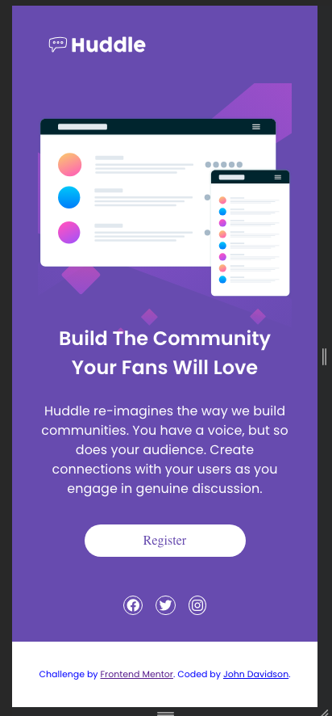
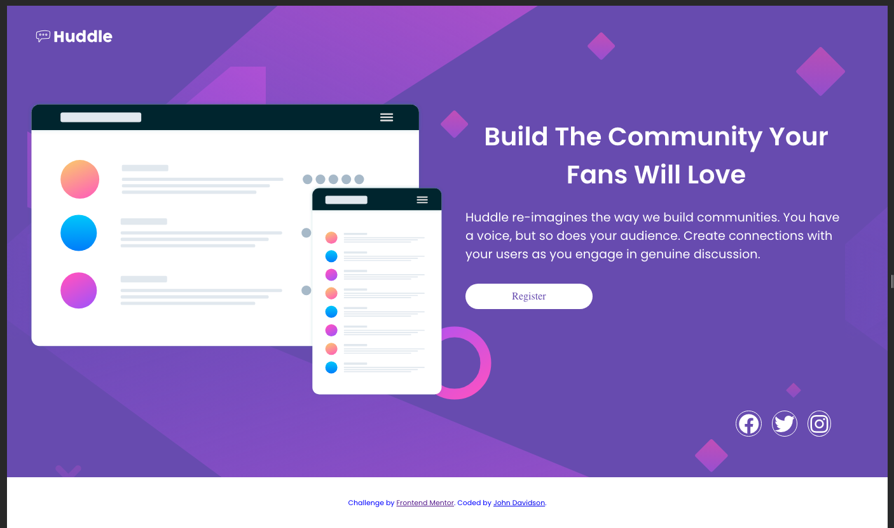
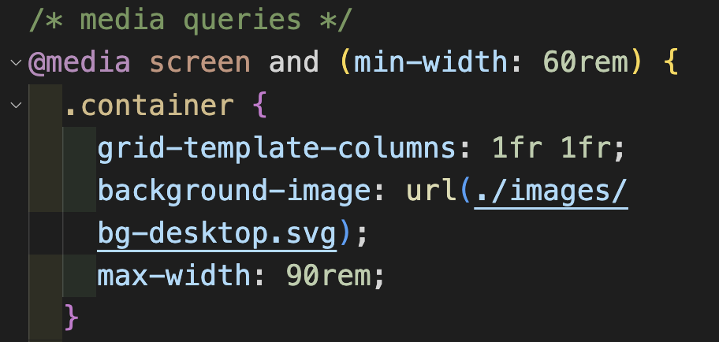

# Frontend Mentor - Huddle Landing Page

This is a solution to the [Huddle Landing Page challenge on Frontend Mentor](https://www.frontendmentor.io/challenges/huddle-landing-page-with-a-single-introductory-section-B_2Wvxgi0). Frontend Mentor challenges help you improve your coding skills by building realistic projects.

## Table of contents

- [Overview](#overview)
  - [The challenge](#the-challenge)
  - [Screenshot](#screenshot)
  - [Links](#links)
- [My process](#my-process)
  - [Built with](#built-with)
  - [What I learned](#what-i-learned)
  - [Continued development](#continued-development)
  - [Useful resources](#useful-resources)
- [Author](#author)
- [Acknowledgments](#acknowledgments)

## Overview

### The challenge

Users should be able to:

- View the optimal layout for the component depending on their device's screen size
- See a hover state on desktop for the Sign Up call-to-action

### Screenshot





### Links

- [Check out the code here](https://github.com/John-Davidson-8/fem-huddle-landing-page)
- [Explore the live site here](https://fem-huddle-landing-page-main.netlify.app/)

## My process

I began mobile first using grid one column. For larger screens I added a media query at 60rem width which added a second column.

### Built with

- Semantic HTML5 markup
- CSS custom properties
- CSS Grid
- Mobile-first workflow

### What I learned

I learned loads in this project as it is my second using CSS Grid. I found after watching tutorials and reading docs on Grid, that putting the theory into practice was challenging. This was a challenging project as I struggled with the transition from mobile view to desktop. The issue was at the 700px width which is tablet width. I am not too happy with the final outcome as I had to use negative margins on the header image, however, this at times of transition covers the logo in the header.

One aspect I relearned on this project was deploying background images through css rather than embedding within the html. I used a url to place a background svg file in the media query.



I also learned about negative margins in this project. Where an image element had to be out of its usual place. And also, I re-learned how to deploy icons from Fontawsome. I forgot the part of placing the link inside the html head. This link I got from [](https://cdnjs.com/libraries/font-awesome).

This is the html below, I have included the entire head as it contains the google fonts also. It is handy for future reference. I was able to style the icons in the css, that code is below also.

```html
<!DOCTYPE html>
<html lang="en">
  <head>
    <meta charset="UTF-8" />
    <meta name="viewport" content="width=device-width, initial-scale=1.0" />
    <!-- displays site properly based on user's device -->
    <!-- font awesome -->
    <link
      rel="stylesheet"
      href="https://cdnjs.cloudflare.com/ajax/libs/font-awesome/6.4.2/css/all.min.css"
      integrity="sha512-z3gLpd7yknf1YoNbCzqRKc4qyor8gaKU1qmn+CShxbuBusANI9QpRohGBreCFkKxLhei6S9CQXFEbbKuqLg0DA=="
      crossorigin="anonymous"
      referrerpolicy="no-referrer"
    />
    <link
      rel="icon"
      type="image/png"
      sizes="32x32"
      href="./images/favicon-32x32.png"
    />

    <title>
      Frontend Mentor | Huddle landing page with single introductory section
    </title>
    <!-- google fonts -->
    <link rel="preconnect" href="https://fonts.googleapis.com" />
    <link rel="preconnect" href="https://fonts.gstatic.com" crossorigin />
    <link
      href="https://fonts.googleapis.com/css2?family=Open+Sans&family=Poppins:wght@400;600&display=swap"
      rel="stylesheet"
    />
    <link rel="stylesheet" href="styles.css" />
  </head>
</html>
```

```css
.icon {
  font-size: 1rem;
  color: white;
  border: 1px solid white;
  border-radius: 50%;
  padding: 0.2rem;
}
```

### Continued development

This is my second project using css grid at its most basic level. However, I feel it is beneficial to break in gently with it as it seems there is much to learn. I also incorporated flexbox which is now becoming second nature.

### Useful resources

- [John Smilga's Udemy tutorials](https://www.udemy.com/course/in-depth-html-css-course-build-responsive-websites/) - This helped me to learn a great deal of html and css. I re-watched the section on CSS Grid.
- [Shruti Balasa's book on CSS Flex and Grid](https://shrutibalasa.gumroad.com/l/css-flex-and-grid) - This is an amazing book which helped me finally understand aspects of Flex-box and Grid. I'd recommend it to anyone still learning this concept.

## Author

- Website - [John Davidson ](https://www.upwork.com/en-gb/freelancers/~018613765e268de80b?viewMode=1)
- Frontend Mentor - [@John-Davidson-8](https://www.frontendmentor.io/profile/John-Davidson-8)

## Acknowledgments

Big shout out to @Grace-snow (https://fedmentor.dev/) and @Chamu at Frontend Mentor for their help as always. Thanks guys.
